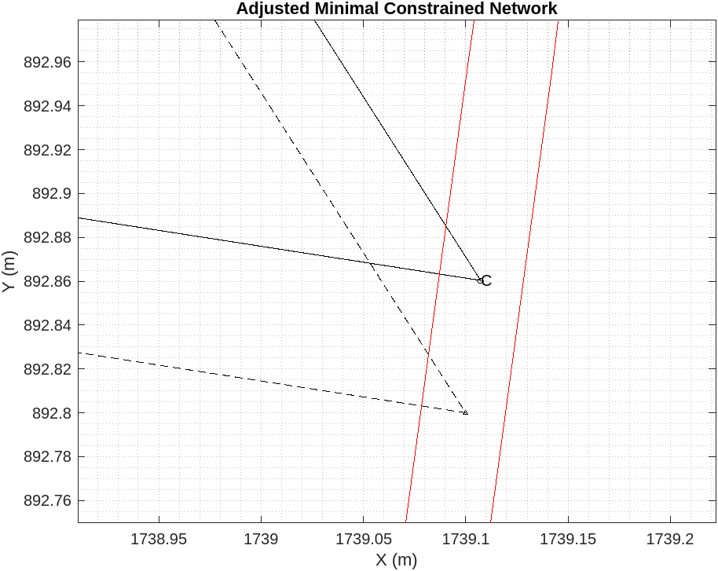

### Astronomia Novaa

### Mars in Retrograde

From the Ptolmey's complex epicyclic explaination of the observed motion of planets over the backdrop of stars. The quest for a simpler and complete explaination, inspired Keppler to look at things from a different perspective. Instead of assuming earth as the center of universe, instead sun is the center and all planets revolve around the massive sun. This then simply explains the retrograde motion of mars as a relative motion seen from earth on the fixed backdrop of night sky.

### Trinagulation to the rescue

From the recent adjustment computations course on constrained adjustment of 2-D traingulated networks. 

 I can appreciate the elegance and ingunity Keppler emoployed to rationally arrive at the ecliptical nature of orbits. A bold claim to depart from from the sacrade and pristine circular geometry. 